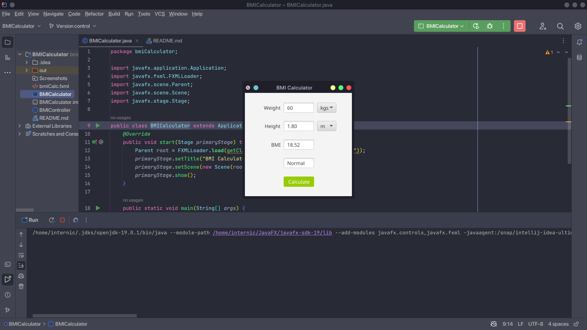

<h2> BMI Calculator App </h2> 

<h3> Description </h3>
Create a BMI calculator app that allows users to enter their weight and height and whether they are entering these values in English or metric units, then calculates and displays the user’s body mass index. The app should also display the following information from the Department of Health and Human Services/National Institutes of Health so that users can evaluate their BMIs:

<h3> Software </h3>
<h4>JavaFX SDK 19 -  https://openjfx.io/ </h4>
<h4>Scene Builder 19.0.0 - https://gluonhq.com/products/scene-builder/ </h4>
<h4>IntelliJ IDEA - https://www.jetbrains.com/idea/ </h4>
<h4>JavaFX config for IntelliJ - https://openjfx.io/openjfx-docs/ </h4>
<h4>Change VM options: --module-path PATH_TO_FX --add-modules javafx.controls,javafx.fxml</h4>

<h4>PATH_TO_FX - path to JavaFX lib folder </h4>

<h3> Screenshots </h3>

