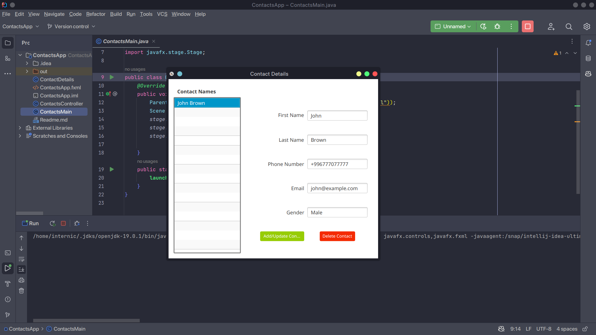

<h2> Contacts App </h2> 

<h3> Description </h3>
Create a Contacts app modeled after the Cover Viewer app (Sections 13.5 –13.6). Store the contact information in an ObservableList of Contact objects. A Contact should contain first name, last name, email and phone number properties (you can provide others). When the user selects a contact from the contacts list, its information should display in a Grid of TextFields. As the information is modified (a Contact’s data is updated, a new Contact is added or an existing Contact is deleted), the contacts ListView should display the updates. The ListView should display the Contact’s last names.

<h3> Software </h3>
<h4>JavaFX SDK 19 -  https://openjfx.io/ </h4>
<h4>Scene Builder 19.0.0 - https://gluonhq.com/products/scene-builder/ </h4>
<h4>IntelliJ IDEA - https://www.jetbrains.com/idea/ </h4>
<h4>JavaFX config for IntelliJ - https://openjfx.io/openjfx-docs/ </h4>
<h4>Change VM options: --module-path PATH_TO_FX --add-modules javafx.controls,javafx.fxml</h4>

<h4>PATH_TO_FX - path to JavaFX lib folder </h4>

<h3> Screenshots </h3>

