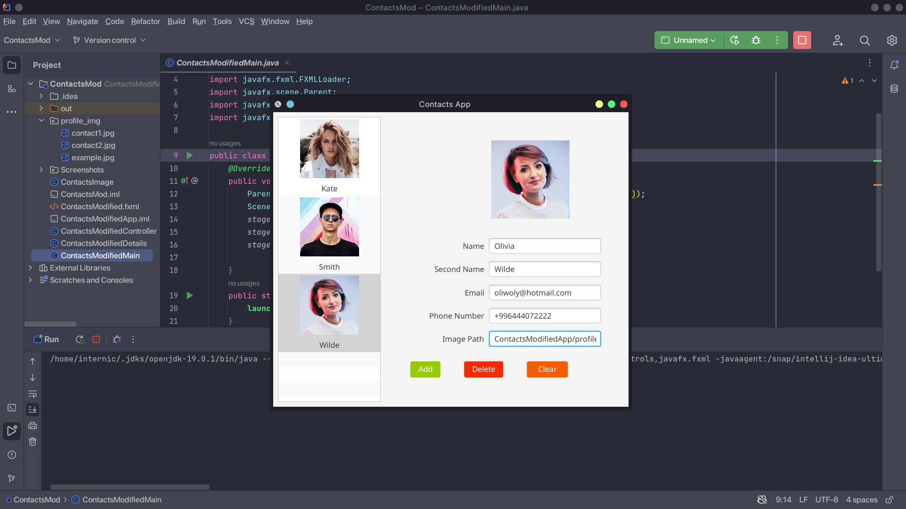

<h2> Contacts App with images </h2> 

<h3> Description </h3>
Modify the Contacts app from the preceding exercises to include an image for each Contact. Provide a custom ListView cell factory that displays the Contact’s full name and picture with the names in sorted order by last name.

<h3> Software </h3>
<h4>JavaFX SDK 19 -  https://openjfx.io/ </h4>
<h4>Scene Builder 19.0.0 - https://gluonhq.com/products/scene-builder/ </h4>
<h4>IntelliJ IDEA - https://www.jetbrains.com/idea/ </h4>
<h4>JavaFX config for IntelliJ - https://openjfx.io/openjfx-docs/ </h4>
<h4>Change VM options: --module-path PATH_TO_FX --add-modules javafx.controls,javafx.fxml</h4>

<h4>PATH_TO_FX - path to JavaFX lib folder </h4>

<h3> Screenshots </h3>

#

