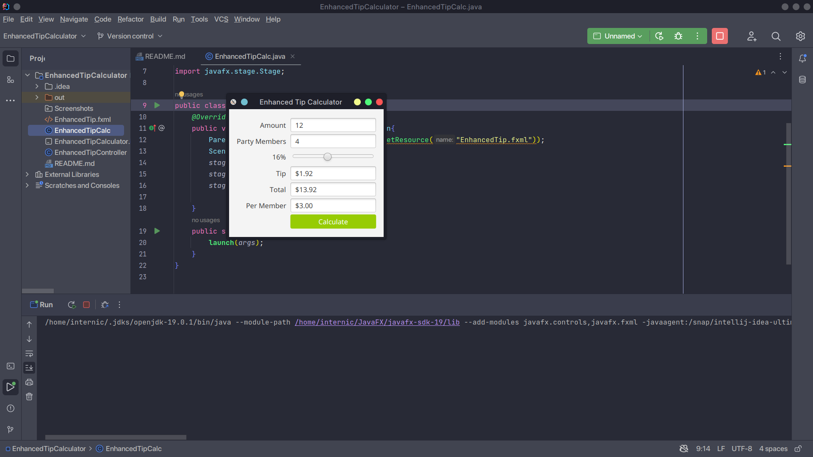

<h2> Enhanced Tip Calculator App </h2> 

<h3> Description </h3>
Modify the Tip Calculator app to allow the user to enter the number of people in the party. Calculate and display the amount owed by each person if the bill were to be split evenly among the party members.

<h3> Software </h3>
<h4>JavaFX SDK 19 -  https://openjfx.io/ </h4>
<h4>Scene Builder 19.0.0 - https://gluonhq.com/products/scene-builder/ </h4>
<h4>IntelliJ IDEA - https://www.jetbrains.com/idea/ </h4>
<h4>JavaFX config for IntelliJ - https://openjfx.io/openjfx-docs/ </h4>
<h4>Change VM options: --module-path PATH_TO_FX --add-modules javafx.controls,javafx.fxml</h4>

<h4>PATH_TO_FX - path to JavaFX lib folder </h4>

<h3> Screenshots </h3>

#

