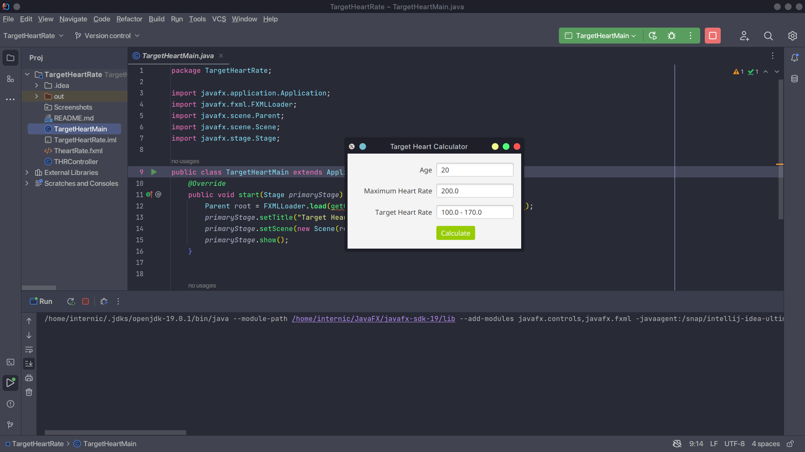

<h2> Target Heart Rate App </h2> 

<h3> Description </h3>
While exercising, you can use a heart-rate monitor to see that your heart rate stays within a safe range suggested by your trainers and doctors. 
According to the American Heart Association (AHA), the formula for calculating your maximum heart rate in beats per minute is 220 minus your age in years. Your target heart rate is a range that is 50–85% of your maximum heart rate.

<h3> Software </h3>
<h4>JavaFX SDK 19 -  https://openjfx.io/ </h4>
<h4>Scene Builder 19.0.0 - https://gluonhq.com/products/scene-builder/ </h4>
<h4>IntelliJ IDEA - https://www.jetbrains.com/idea/ </h4>
<h4>JavaFX config for IntelliJ - https://openjfx.io/openjfx-docs/ </h4>
<h4>Change VM options: --module-path PATH_TO_FX --add-modules javafx.controls,javafx.fxml</h4>

<h4>PATH_TO_FX - path to JavaFX lib folder </h4>

<h3> Screenshots </h3>

