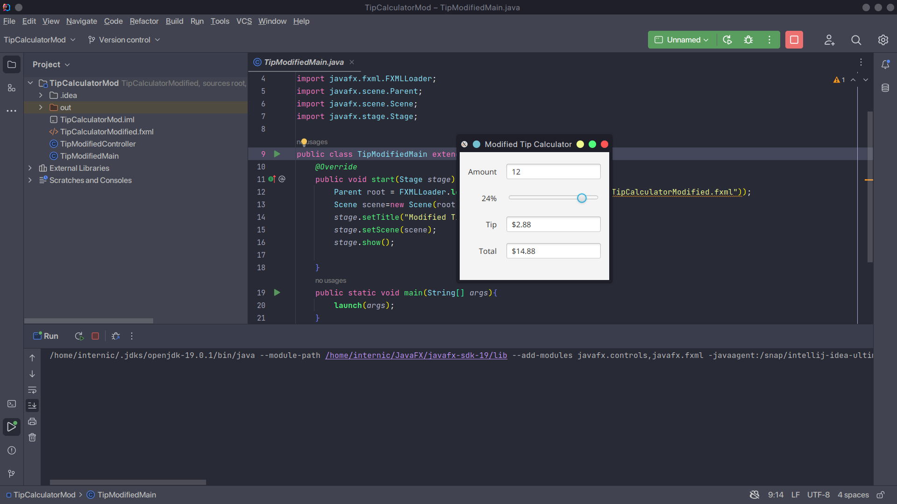

<h2> Tip Calculator App - Modified</h2> 

<h3> Description </h3>
The Tip Calculator app from Section 12.5 does not need a Button to perform its calculations. Re-implement this app to use property listeners to perform the calculations whenever the user modifies the bill amount or changes the custom tip percentage. Also use a property binding to update the Label that displays the tip percentage.

<h3> Software </h3>
<h4>JavaFX SDK 19 -  https://openjfx.io/ </h4>
<h4>Scene Builder 19.0.0 - https://gluonhq.com/products/scene-builder/ </h4>
<h4>IntelliJ IDEA - https://www.jetbrains.com/idea/ </h4>
<h4>JavaFX config for IntelliJ - https://openjfx.io/openjfx-docs/ </h4>
<h4>Change VM options: --module-path PATH_TO_FX --add-modules javafx.controls,javafx.fxml</h4>

<h4>PATH_TO_FX - path to JavaFX lib folder </h4>

<h3> Screenshots </h3>

